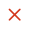
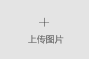

# imgUp
插件主体
```
<div class="z_photo upimg-div clear" >
    <!--<section class="up-section fl">-->
        <!--<span class="up-span"></span>-->
        <!---->
        <!---->
        <!--<input name="img[]" value="" type="hidden">-->
    <!--</section>-->
    <section class="z_file fl">
        
        <input type="file" name="file" id="financial_img" class="file" data-url="/upload/url" data-width="150" data-height="100" data-dir="img" data-name="img[]" data-max="3" accept="image/jpg,image/jpeg,image/png,image/bmp" />
    </section>
</div>
<aside class="mask works-mask">
    <div class="mask-content">
        <p class="del-p">您确定要删除图片吗？</p>
        <p class="check-p"><span class="del-com wsdel-ok">确定</span><span class="wsdel-no">取消</span></p>
    </div>
</aside>
```

##### 参数设置
在主体的input组件上设置参数
data-width: 设置上传参数宽度，用于后期处理，默认"150"；
data-height: 设置上传参数高度，用于后期处理，默认"100"；
data-dir: 设置上传参数存储路径，默认"img";
data-url: 设置图片上传的服务器地址，上传参数及返回参数见下；
data-name: 设置上传后生成的input隐藏框的name属性；
data-max: 设置最大上传数量，数量达到后无法继续添加；

##### 上传参数
file: base64位图片数据，  
width: data-width数据，  
height：data-height数据，  
dir： data-dir数据  

##### 返回参数要求
id: 图片id，用于生成的input隐藏框的value属性，  
src: 可访问的图片路径
